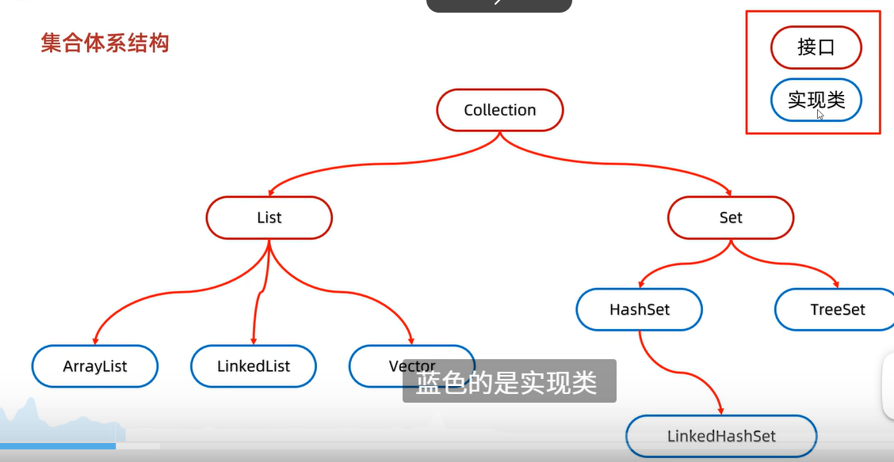

# JAVA进阶

## 集合

- 1.几何体系结构：单列集合/双列集合

- List:有序（存或取的顺序一样），可重复，有索引 
    set:无序，去重复，无索引

- 2.Collection所有单列对象的接口，不能直接创建对象

```JAVA
Collection<String> coll=new ArrayList<>();
coll.add("aaa");
coll.clear();
coll.remove("aaa");
boolean result=coll.contains("bbb")
coll.isEmpty()
```

    - Collection遍历：迭代器遍历(相当于是一个指针，不依赖索引)
    /增强for遍历
    /Lambda表达式遍历
```JAVA
    - (1)iterator类, Iterator<E> it=list.iterator()//返回一个迭代器对象
    boollean hasNext()//判断当前位置是否有元素
    String str=it.next()//获取当前位置元素
    it.remove//不能用集合的方法增加或者删除
    //迭代器遍历
    Collection<String> coll=new ArrayList<>();
    Iterator<String> it=coll.iterator();
    while(it.hasNext){
        String str=it.next();
        System.out.println(str);
    }
```
    - 增强for迭代器，底层就是迭代器，所有单列集合和数组:其中的s只是一个第三方变量
    for(String s:list){
        System.out.println(s);
    }
    - Lambda表达式遍历，
```JAVA
    //匿名内部类
    coll.forEach(new Consumer<String>()){
        @Override
        public void accept(String s);
    }
    //表达式()->{}
    coll.forEach(s->System.out.println(s));
```

- List集合
```JAVA
void add(int index,int element);
remove();
String str=set(int index,E element);
String str=get(int intdex)
//创建一个集合
List<String> list=new ArrayList<>();//实例化创建一个集合
```

    - List集合的遍历方式
    多了列表迭代器遍历，普通for遍历
    list.ListItrator(),也是一个接口,获取一个列表迭代器对象

*** 总结：要删除：迭代器\要添加，列表迭代器，剩下的是仅仅只是遍历

- ArrayList集合
    - 底层是Object数组elementDate，添加第一个元素，会出现一个默认长度为10的数组，当数组满了，会自动扩容1.5倍，若还是放不下，则以新数组为主
- LinkedList集合
    - 底层是双链表，查询慢，增删快


##### 泛型

- 约束操作的的数据类型<String>统一数据类型

- 只支持引用数据类型，对应包装类，因为会转成object类型

- 翻译的擦除，伪泛型
`public class ArrayList(E){};//泛型类`
`public <E> void show(T t){}//泛型方法`
- 泛型接口public interface List<E>{};相当于在接口中给出方法声明，然后需要用实例类来实现，但是不能new 对象
