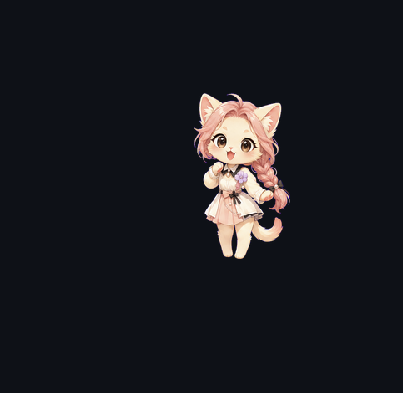

# 基于Hatch Pet的桌宠生成流程文档

# 1\. 目标与交付产物

## 1\.1 核心目标

依托hatch\-pet流程，实现从角色设定到可用桌宠资源包的全流程标准化产出，确保交付件符合行业规范，可直接用于导入、分发或二次开发。

## 1\.2 最终交付产物

- pet\.png：8列×9行动画图集，共计72格，包含桌宠所有动作帧

- pet\.json：桌宠核心配置文件，定义动作逻辑、触发规则等

- QA预览图（Contact Sheet/检查图）：用于直观校验帧序列、风格一致性及透明通道等

- 可发布桌宠目录：标准化目录结构，支持直接导入相关平台或对外分发

# 2\. 前置准备

## 2\.1 输入素材

- 角色参考图：建议提供多角度视图，便于确保角色轮廓、比例一致性

- 风格要求：明确界定视觉风格（像素风/非像素风）、Q版还原程度及整体色调规范

- 品牌元素（可选）：需融入的品牌配色、LOGO、服饰符号等标志性元素

## 2\.2 动作要求

为保障桌宠交互体验，需至少定义以下基础动作组（符合桌宠常规使用场景）：

- idle（待机动作）：桌宠无交互时的默认循环动作

- walk（行走动作）：桌宠移动时的动画序列

- run（可选动作）：桌宠快速移动时的动画序列

- jump/fall（可选动作）：桌宠跳跃、下落时的动画序列

- sleep（休眠动作）：桌宠长时间无交互时的休眠动画

- interact（点击反馈动作）：用户点击桌宠时的响应动画

## 2\.3 技术约束

- 图集规格：固定为8列×9行网格布局，总格数严格控制为72格

- 空白帧处理：未使用的网格格位需以透明填充，避免影响整体显示效果

- 背景要求：所有帧图像背景均为透明（RGBA格式），无任何底色残留

- 命名规范：帧文件命名需包含动作类型、帧序列、版本号，确保命名统一、可追溯

# 3\. 标准生成流程（基于hatch\-pet）

## 步骤1：需求冻结（Brief阶段）

明确项目核心需求，完成需求文档固化，为后续流程提供明确依据。

- 输入：角色定位说明、动作清单、视觉风格详细要求

- 输出：建议生成pet\_brief\.md文档，固化需求细节，便于团队同步及后期追溯

- 检查点：
        

    - 角色视觉风格唯一且明确，无模糊表述

    - 动作数量及帧需求，符合72格图集的总量约束

    - 已明确界定“像素风”或“插画风”，无风格歧义

## 步骤2：基础角色帧生成（ImageGen阶段）

通过hatch\-pet集成的imagegen工具，生成角色关键帧及动作参考，奠定动画基础。

- 输出：
        

    - 按动作分类的关键帧草稿（建议按动作建立独立目录管理）

    - 每个动作的首尾帧，确保后续动画循环的连贯性

- 检查点：
        

    - 角色轮廓、头身比例一致，无帧间漂移现象

    - 配色方案稳定，帧间无明显色偏，符合预设色调要求

    - 角色透视角度统一，避免出现“忽大忽小”的视觉偏差

## 步骤3：动作补帧与图像清洗

基于关键帧，补充中间帧形成完整动画序列，并对图像进行优化处理，确保动画流畅、画面干净。

- 输出：每个动作对应的连续帧PNG序列（透明背景，符合技术约束要求）

- 检查点：
        

    - 动作循环自然，首尾帧衔接流畅，无跳帧、卡顿现象

    - 角色重心平稳，动画过程中无明显抖动

    - 图像边缘干净，无白边、脏像素等冗余元素

## 步骤4：8×9图集组装

按照hatch\-pet规范，将所有动作帧有序装配到8列×9行的网格中，生成最终图集。

- 输出：
        

    - pet\.png（最终动画图集，符合技术约束）

    - 格位映射表：明确动作与图集行列、帧范围的对应关系，便于后续配置校对

- 检查点：
        

    - 图集总格数不超过72格，无超出约束的情况

    - 未使用的空白格均为透明填充，无底色残留

    - 每格尺寸、锚点一致，确保动画播放时角色位置稳定

## 步骤5：pet\.json配置生成与校对

配置桌宠的动作逻辑、播放速度、触发条件及循环规则，确保配置与图集匹配，满足交互需求。

- 建议配置字段：
        

    - 基础信息：name（桌宠名称）、author（作者）、version（版本号）

    - 图集配置：sprite（图集路径、网格尺寸等基础信息）

    - 动画配置：animations（动作对应的帧段范围、播放帧率fps、是否循环loop）

    - 行为配置：behaviors（空闲时随机动作、用户交互响应逻辑等）

- 检查点：
        

    - 配置中的帧索引与图集格位映射完全一致，无错配情况

    - 动作播放时长合理（idle动作播放速度较慢、walk动作中等、interact动作较快）

    - 缺失动作需设置降级策略（建议 fallback 至idle动作，避免异常）

## 步骤6：可视化QA校验（关键环节）

借助hatch\-pet的QA流程，生成Contact Sheet（检查图），对桌宠资产进行全面验收，避免问题流入发布环节。

- 必查项：
        

    - 帧连续性：动画播放无闪烁、无错帧、无卡顿，循环流畅

    - 透明通道：所有帧背景透明，无任何底色残留

    - 网格对齐：所有帧均在网格范围内，无越界、偏移现象

    - 动作语义：动作表现与定义一致（如walk动作需呈现明显行走姿态）

    - 风格一致性：整套资产采用统一美术语言，无风格割裂现象

## 步骤7：打包发布

整理标准化发布目录，附带相关说明文档，确保交付物可直接用于导入或分发。

建议目录结构：

```plain text
pet/
├─ pet.png          # 最终动画图集
├─ pet.json         # 桌宠配置文件
├─ preview.png      # QA预览图（检查图）
├─ README.md        # 桌宠说明、使用方法
└─ CHANGELOG.md     # 版本更新日志
```

# 4\. 帧位规划建议（示例）

为避免后期帧数量超出72格约束，建议提前制定帧位“预算表”，合理分配各动作的帧数量，示例如下：

|动作类型|帧数量|备注|
|---|---|---|
|idle（待机）|12|循环流畅，动作舒缓|
|walk（行走）|16|步态自然，帧间衔接流畅|
|run（奔跑）|12|可选，动作幅度大于行走|
|sleep（休眠）|8|动作舒缓，符合休眠场景|
|interact（点击反馈）|12|动作敏捷，反馈及时|
|jump/fall（跳跃/下落）|8|可选，动作连贯|
|预留帧|4|用于后期调整或补充动作|
|合计|72|符合图集总格数约束|

# 5\. 实操经验与问题解决

## 5\.1 核心问题及解决方案

- 配置相关问题：核心难点在于config\.toml与auth\.json的配置。建议获取API\-KEY后，优先使用CC\-switch一键配置（效率更高、出错率低）；若获取的API\-KEY绑定分组无image2等生图模型权限，需更换具备生图模型调用权限的中转站。

- image工具配置问题：配置过程中易出现image内置工具不可用的报错，可通过将角色参考图上传至官方OPEN\-AI平台生成图像，替代内置工具，解决报错问题。

- 本地图片上传问题：遇到本地图片无法上传至OPEN\-AI官网的情况，可采用轻量化生成方式规避，或开通本地文件上传权限，确保素材正常使用。

## 5\.2 效果展示

桌宠最终效果如下：



